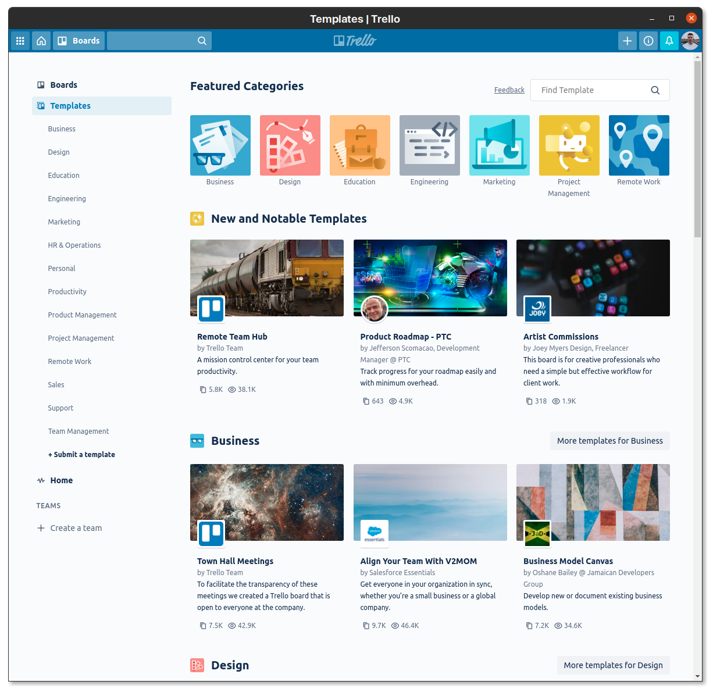

# Trello Desktop

> Unofficial Trello Desktop Application

This app provides an Electron wrapper around Trello for use on Linux.
Desktop apps for Windows and macOS are already provided officially by Trello.

## Install

You can go to the [releases page](https://github.com/eugenetriguba/trello-desktop/releases/latest) to download the appropriate file (deb, rpm, AppImage, etc.) and install it accordingly.

You may also need to add a `trello.desktop` file to `~/.local/share/applications`. If you go into the `build/` folder in the source code of this app, you'll find a `trello.desktop` file already that you can use to base yours off of.
